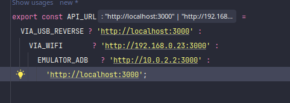

## Como fazer o APP mobile ter acesso a API local
### Se estiver usando o emulador Android
Em src/services/index.ts coloque a const EMULATOR_ADB como true e as outras false

### Se estiver usando o via USB e emulando no celular real
Em src/services/index.ts coloque a const VIA_USB_REVERSE como true e as outras false e rode os comandos
```bash
adb devices
adb reverse tcp:3000 tcp:3000
```

### Se estiver usando via ride local WIFI
Em src/services/index.ts coloque a const VIA_WIFI como true e as outras false e rode os comandos
```bash
hostname -I | awk '{print $1}'
sudo firewall-cmd --add-port=3000/tcp --permanent
sudo firewall-cmd --reload
```
O IP retornado pelo comando hostname -I deve ser colocado depois "VIA_WIFI ?" dentro do arquivo src/services/index.ts

